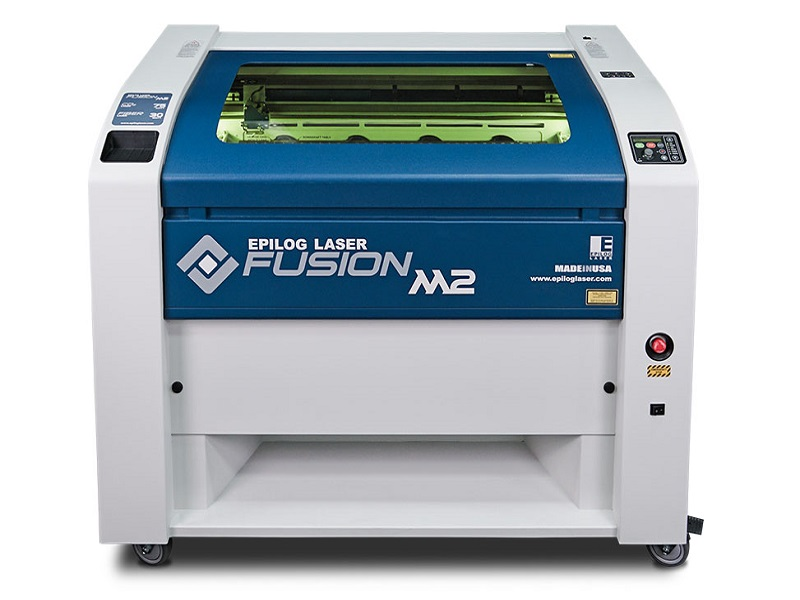

# Laser cutter (co2 laser)

a. Laser cutter can cut natural materials, wood leather 
b. After burning we have to wait minimum one minute to purify the smoke/fume by the purifier which            contains 3 layers of filters
a. Filter for big particles (pre filter bags)
b. Filter for medium particles (HEPA filter)
c. Filter for small particles (carbon filter, chemical filter)

[Go to Home](readme.md)