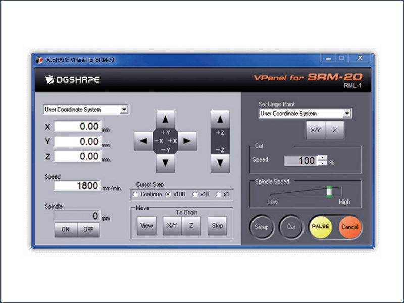
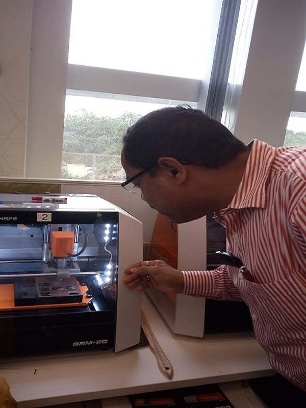
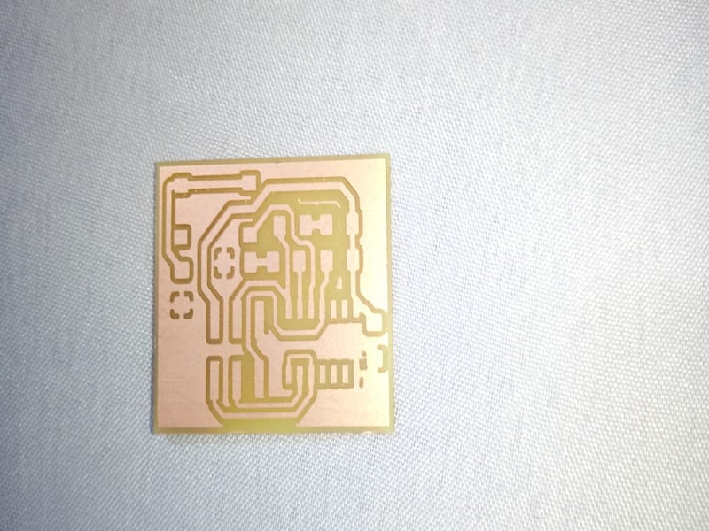

# Mini Milling Machine (Mini CNC)

c

It is a machine to perform small fabrics with resolution of 1 micron.

The build plate is 1x3/32 mm 

The milling tool can perform 2 port cutting, 4 port cutting and could be flat nose or balled nose.

## Milling Procedures

1. For milling the circuit we have to use the 1/64 bit where as for cutting the edge we use 1/32 mm bit.

2. First we have to fit the 1/64 milling bit and make XY axis as zero (from user coordinate system, top right corner of the vpanel shown in fig below)

3. Then lower the bit in Z axis and touch the board. By pressing down the bit it has to be tightened.

4. Then at that position we need to set Z as zero (from user coordinate system menu,top right corner of the vpanel shown in fig below)

5. Then move the bit 2 mm in Z axis and press the cut.

6. Load the desired file (trace.rml) and press output to start the milling.

7. Once the milling is done it is required to change the bit to 1/32 mm to cut the surface.

8. After changing the bit press XY to move to the origin (from bottom MENU, To Origin of the vpanel shown in fig below )

9. Then move the bit in Z axis to touch the board and tighten it properly.

10. Then set Z as zero (from user coordinate system, top right corner of the vpanel shown in fig above)

11. Then up the bit by 2 mm in Z axis and press cut.

12. Load the file to start the cut (cut.rml) and press output.

13. Then the job will start cutting the edge of the circuit.

14. Now the pcb is ready as shown below.

[Go to Home](readme.md)