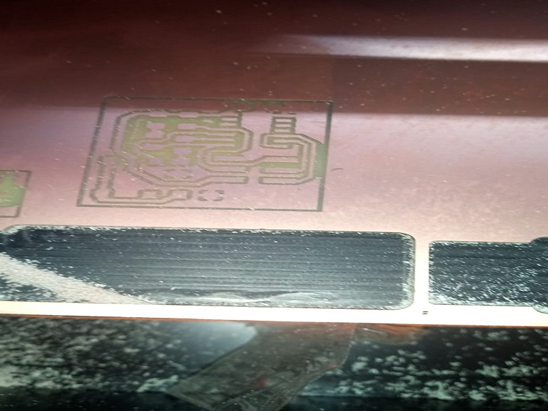

# Mini Milling Machine (Mini CNC)

It is a machine to perform small fabrics with resolution of 1 micron.

The build plate is 1x3/32 mm 

The milling tool can perform 2 port cutting, 4 port cutting and could be flat nose or balled nose.

## Milling Procedures

[Go to Home](readme.md)