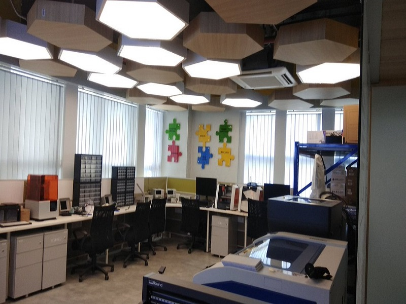
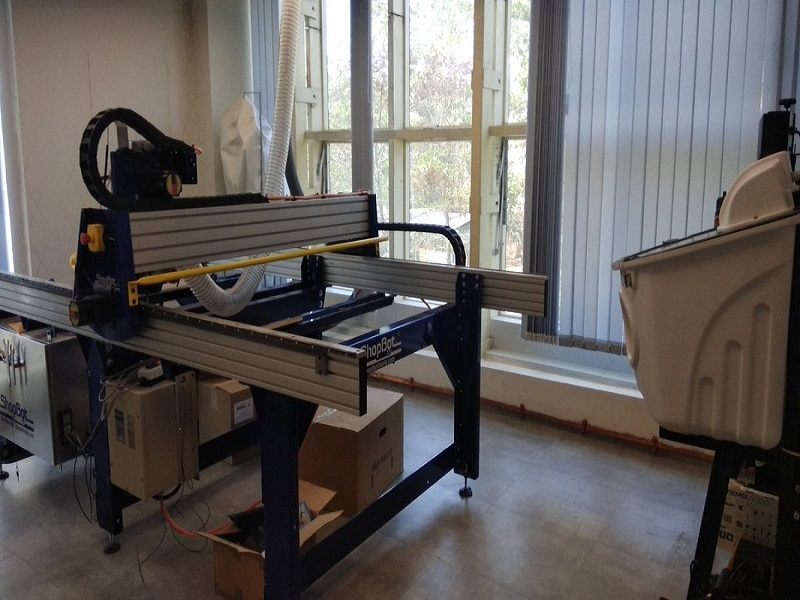

# **Welcome to the fabzero wiki!**

## Name: Susil Sethy

# TUTORIAL FOR DAY1, 18.03.2019

Initially tutor explained that there are basically two rooms identified for installing Fablab equipments.

1.	Noisy & Messy Room: Where machines like Computer Numeric Control (CNC) and other accessories such as       Band Saw, Scroll Saw, Dust collecting machine etc. are installed.

2.  Clean & dust free Room: Where machines like cutting machine such as Vinyle cutter, Laser cutter,           Milling machine (Mini CNC), Electronics (Oscilloscope, Pulse Generator etc.), 3D Printers (Fuse            Deposition Manufacturing, FDM, by melting PLA filaments)

## THEORY

## 1. We studied about vinyle cutter machine. 

a. How to fix the cutting bit in the vinyle spindle.
b. How to load the vinyle roll etc.

## 2. Laser cutter (co2 laser)
a. Laser cutter can cut natural materials, wood leather 
b. After burning we have to wait minimum one minute to purify the smoke/fume by the purifier which contains 3 layers of filters
a. Filter for big particles (pre filter bags)
b. Filter for medium particles (Hepa filter)
c. Filter for small particles (carbon filter, chemical filter)

## 3. Milling machine (mini CNC)

Fabrication of small devices and pcb then soldering

## 4. Electronics for testing the devices (oscilloscope, pulse generator etc.)

## 5. 3D printer (fuse deposition material) Sindoh,

 printing 1.75 mm to 0.4 mm

Build plate, cartridge, filament of different colors

## 6. 2D printers

## 7. CNC (Shopbot)

## The instructions are as given below

1. Power on the controller first

2. Switch on the controller and set the origin zero using the zero plate and aligator.

3. Press the reset switch to start the machine to move.

4. Before starting the project it is mandatory to follow the procedures like putting the ear guard (Head      Phone), Mouth guard (Mask) and other necessary precautionary measures as the spindle rotates at a speed of 14000 rpm and any problem may hurt the operator and the lab manager.

5. During the project it is mandatory to vacate the room and only the Lab manager and operator will be present with the safety set to start the job with the door close in order to stop the dust to travel to the other rooms.

6. Saw

a. Scroll saw (for cutting woods)

b. Band saw

c. Object water jet

# Tutorial for day 2, 19.03.2019

## Installing Visual studio code, Inkscape, Cura, Git  for practical 

# Tutorial for day 3, 20.03.2019

Installed KiCad for designing, 3D WOX for printing 3D objects in Sindoh, Used Inkscape to design the sticker to be cut by vinyle cutter (Roland), Used Vinyle cutter to cut sticker in name for putting in Laptop.

# Tutorial for day 4, 21.03.2019

PCB Designing

First Designing the circuit in KiCAD
 Then by pressing the icon Assign PCB footprints to schematic symbols (Adjucent to symbol NET)

 Select Preferences

 Manage Footprint Libraries

 Project specific Libraries

 Select Folder where the file is present

 then OK

The desired file should be listed in the bottom

OK then Apply, Save Schematic & Continue

Pressing F5 to go to the Schematic and drawing the routes

Using MonoFab

1.

# Tutorial for day 5, 25.03.2019

[Go to 3D Printer](3dprinter.md)

[Go to laser cutter](lasercutter.md)

[Go to monofab](monofab.md)

[Go to Shopbot](shopbot.md)

[Go to vinyle cutter](vinylecutter.md)

