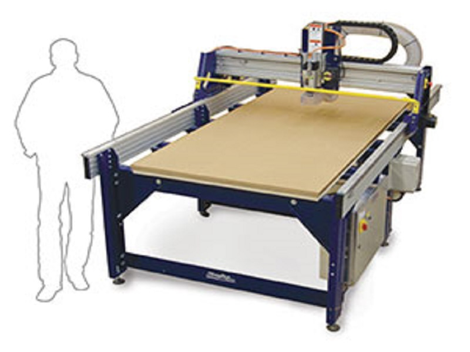

# CNC (Shopbot)

## Precautionary Majors

1.  During the project it is mandatory to vacate the room and only the Lab manager and operator will be present with the safety set to start the job with the door close in order to stop the dust to travel to the other rooms.

2. Before starting the project it is mandatory to follow the procedures like putting the ear guard (Head      Phone), Mouth guard (Mask) and other necessary precautionary measures as the spindle rotates at a speed    of 14000 rpm and any problem may hurt the operator and the lab manager.

## Operating instructions are as given below

1. Power on the controller first with appropriate power either 110v/240v.

2. Power to spindle motor should be off.

3. Power supply should be separate for controller and spindle motor.

4. Switch on the controller  (Switch located in controller)

5. Release both emergency STOP switches 

6. Press the rest switch (in the hand unit) to power to motor, there will be a click sound inside the controller.

7. Open the shopbot s/w in the PC

8. Select to cut

9. Open the yellow box it will show X Y Z axis for movement and positioning with 1 2 3 4 5 6 7 8 

10. By pressing desired button we can move the maching in X Y Z axes.

11. Next to set the origin zero using the zero plate and aligator clip.

12. Take out the zero plate and aligator clip

13. Touch both to verify that 1 will glow as green

14. Then connect the aligator clip to the spindle and place the zero plate below the milling bit and hold slightly in two fingers apart.

15. Go to Z axis and press enter

16. A new pop up window will come and ask to place  the plate and connect the aligator and after confirmation from the manager press OK

17. It will move the milling bit to touch the zero plate in Z axis  and return a little bit up.

18. Then a new pop up window will appear and ask to remove the zero plate and aligator clip and place it in proper position and once done press OK.

19. Now the zero is set.

[Go to Home](readme.md)